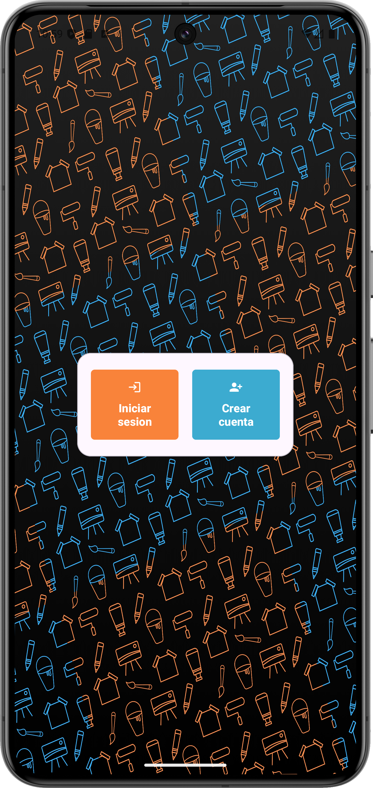
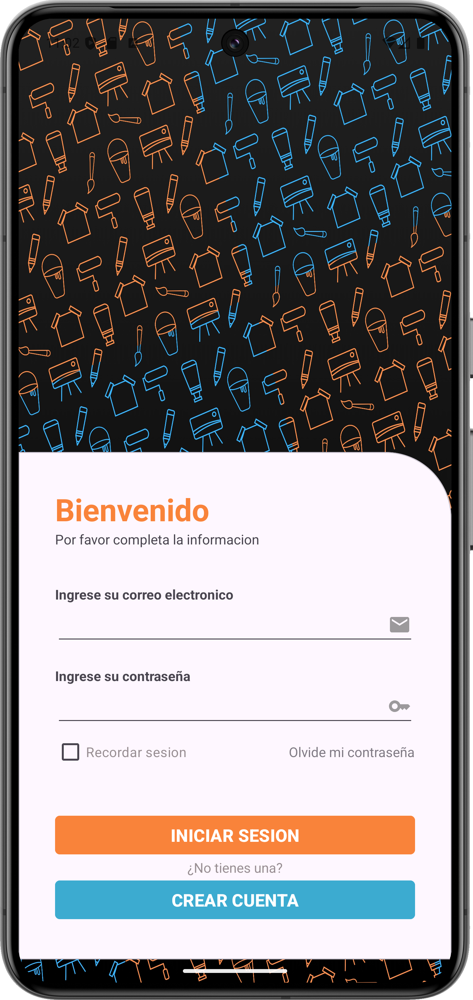
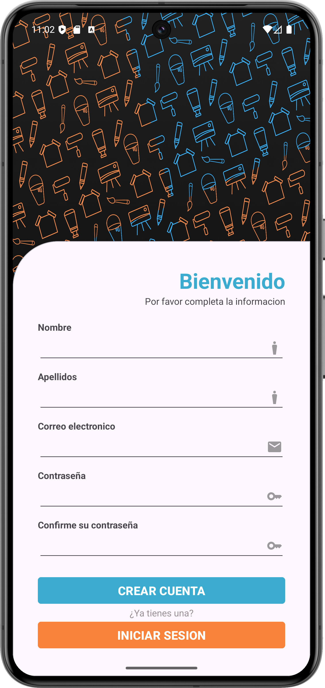
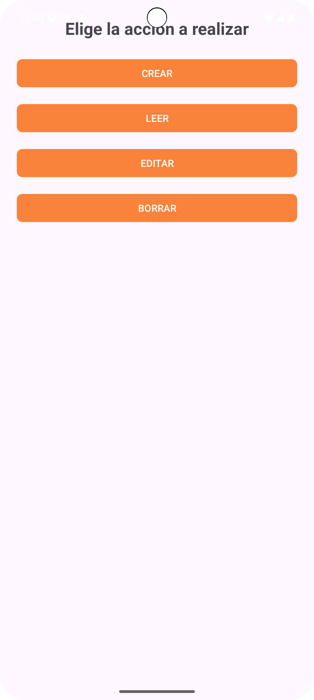

# Android Firebase Auth — Trueques

> **Proyecto académico — prototipo**  
> Aplicación Android (Java) que muestra pantallas de **registro**, **inicio de sesión** y CRUD con integración básica en Firebase. Subido como **demostración de trabajo académico**; no es un producto listo para producción. El objetivo es mostrar estructuración de un proyecto Android, uso básico de Firebase y decisiones de implementación típicas en una app de gestión de usuarios.


## ⚠️ Estado del proyecto

* **Estado:** prototipo incompleto. Pueden existir errores de compilación en distintos entornos.
* **Funcionalidad:** Algunas funcionalidades están como prototipos o simulaciones (por ejemplo el flujo de autenticación puede no usar FirebaseAuth en todos los puntos).

## Objetivo del repositorio

Mostrar un aporte académico: diseño de pantallas de login/registro y la interacción básica con Firebase (Firestore / Auth).


## Qué contiene

- Flujos básicos: registro, login y pantalla de inicio.  
- Ejemplos de operaciones con Firestore (lectura/escritura).  
- Estructura del módulo Android (`app/`), recursos y manifiesto.  
- Documentación de restricciones y pasos para ejecutar localmente.


## Arquitectura general

El proyecto sigue una arquitectura sencilla tipo **MVC (Model-View-Controller)**, donde:
- **Activities (View):** gestionan la interfaz de usuario y eventos.
- **Firebase Services (Model):** proveen autenticación y persistencia.
- **Controladores (Controller):** manejan la lógica entre la vista y Firebase.


## Dependencias principales

- **Firebase Authentication** — gestión de usuarios y sesiones.  
- **Cloud Firestore** — almacenamiento y lectura de datos.  
- **Material Components** — diseño moderno y componentes visuales.  
- **Gradle Plugin (com.google.gms:google-services)** — integración Firebase.


## Estructura del repositorio
```
android-firebase-auth-trueques/
├─ app/ 
│ ├─ src/main/java/...          
│ ├─ src/main/res/...           
│ └─ google-services.json       
├─ screenshots/                 
├─ README.md
└─ .gitignore
```

- `app/src/main/java/.../LoginActivity.java` (o `IniciarSesion.java`) — lógica de inicio de sesión.  
- `app/src/main/java/.../RegisterActivity.java` (o `Registro.java`) — lógica de registro.  
- `app/src/main/java/.../MainActivity.java` (o `Inicio`) — pantalla principal post-login.  
- `app/src/main/AndroidManifest.xml` — registro de actividades y permisos.  
- `app/build.gradle` / `build.gradle` — configuración de dependencias (incluye Firebase). 

---

<h2><b>Cómo ejecutar</b></h2>
<h3 style="margin:0"><b>1) Clonar el repositorio:</b></h3>

```bash
git clone https://github.com/Brannd-Asahi/android-firebase-auth-trueques.git
cd android-firebase-auth-trueques
```

### 2) Requisitos previos:
   
- Android Studio
- JDK 11+
- Android SDK (API 24+).

### 3) Abrir el proyecto en Android Studio

- `File → Open` → seleccionar la carpeta del repo.
- Esperar a que Android Studio sincronice Gradle y descargue dependencias.

### 4) Configurar Firebase (archivo `google-services.json`)

- Entra a Firebase Console y crea un proyecto (si no lo tienes).
- Registra una nueva App Android con el ApplicationId (package name) que usa el proyecto.
- (Opcional pero recomendable) añadir la huella SHA-1 si se usara Google Sign-In o ciertas APIs.
- Descarga `google-services.json` y cópialo en `app/` en tu máquina local:

### 5) Sincronizar y compilar

- En Android Studio: `Sync Project with Gradle Files`

### 6) Ejecutar en emulador o dispositivo

- Crear/empezar un emulador o conectar un dispositivo físico (depuración USB).
- En Android Studio: Run → seleccionar dispositivo → Run `app`

### 7) Probar flujos básicos

- Registrar un usuario via la pantalla de registro (o crear un usuario desde Firebase Auth console).
- Iniciar sesión con el usuario registrado.
- Verificar que las lecturas/escrituras a Firestore funcionen (revisar Firestore Console).


## Capturas de la aplicacion 

### Main Activity  
<p align="center">
  
</p>

### Iniciar Sesion  
<p align="center">
  
</p>

### Crear Cuenta  
<p align="center">
  
</p>

### CRUD
<p align="center">
  
</p>


<br>

## 👨‍💻 Autor

**Brandon B. H.**  
Proyecto académico desarrollado como práctica de Android Studio con Firebase.  
brandonbritohernandez@gmail.com
